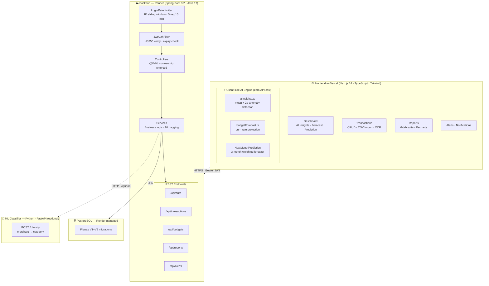

<div align="center">

# FinTrack — AI-Powered Personal Finance Platform

**Full-stack finance app with real-time anomaly detection, predictive budget forecasting, and smart alerts — built to production standards.**

[](https://fintrack-liart.vercel.app)

[](https://github.com/GanasalaChandana/fintrack/actions)
&nbsp;
[](https://spring.io/projects/spring-boot)
&nbsp;
[](https://nextjs.org/)
&nbsp;
[](https://github.com/GanasalaChandana/fintrack/actions)
&nbsp;
[](LICENSE)

</div>

---

## 🧠 Key Highlights

> What separates FinTrack from standard CRUD finance apps:

- **Statistical anomaly detection** — flags unusual spend using mean + 2σ per category. Runs 100% client-side, zero latency, zero API cost
- **Next-month prediction** — 3-month weighted rolling average (weights 3-2-1) projects next month's income, expenses, and savings with trend momentum and a confidence rating
- **Predictive budget forecasting** — daily burn rate × days remaining = end-of-month projection with per-category "at risk" warnings
- **IP-based sliding window rate limiting** — 5 login attempts / 15 min per IP, no Redis needed (`ConcurrentHashMap` + `Deque<Long>`)
- **Refresh token rotation with replay detection** — SHA-256 hashed, single-use; detecting a replayed token revokes ALL active sessions
- **52 backend tests (0 failures)** — Mockito service tests + `@WebMvcTest` controller slice tests with full JWT security mocked

---

## 📸 Screenshots

| Dashboard + AI Insights | Smart Alerts | Reports & Forecast |
|:---:|:---:|:---:|
|  |  |  |
| AI anomaly cards + burn rate forecast visible above the fold | 8 rule types with severity badges and actionable context | 6-month spending forecast with trend line |

👉 **[Try the live demo → fintrack-liart.vercel.app](https://fintrack-liart.vercel.app)**

---

## 🎬 Demo

<div align="center">

[](https://fintrack-liart.vercel.app)
&nbsp;
[](https://fintrack-liart.vercel.app)

</div>

**Key flows to explore in the live app:**
- 🤖 **Dashboard → AI Insights row** — anomaly cards + burn rate forecast + next-month prediction
- 📊 **Reports tab** — 6-tab suite with spending trend, budget comparison, category breakdown
- 🔔 **Alerts page** — smart rule-based alerts with severity badges
- 📥 **Transactions → Import CSV** — bulk upload with auto-tagging

---

## ✨ Features

| | Feature | What it does |
|---|---|---|
| 🤖 | **AI Anomaly Detection** | Mean + 2σ per category — *"Housing ($1,200) is 277% above your $324 avg — review your largest category"* |
| 🔮 | **Next-Month Prediction** | 3-month weighted forecast — *predicts income, expenses, savings rate with trend momentum and High/Medium/Low confidence* |
| 📈 | **Budget Forecasting** | Burn rate projection — *"On track to spend $3,855 vs $3,150 budget — $705 over. Housing at 200%."* |
| 🔔 | **Smart Alerts** | 8 rule types: large transactions, spending spikes, category concentration, income tracking |
| 🔄 | **Recurring Detection** | Levenshtein similarity matching identifies subscriptions and projects future bills |
| 🧾 | **Receipt Scanner** | Camera/file upload → Tesseract.js OCR extracts merchant, amount, date |
| 📊 | **Interactive Reports** | 6-tab report suite: overview, trends, comparison, 6-month forecast, budget history, custom |
| 🎯 | **Category Auto-Tagging** | Python FastAPI ML service classifies transactions by merchant + amount |
| 🔐 | **Secure Auth** | JWT HS256 + refresh token rotation + IP rate limiting + BCrypt password hashing |

---

## 🏗️ Architecture



---

## 🔐 Security Design

### Request Lifecycle
```
HTTP Request
  → LoginRateLimiter (IP sliding window, 5/15min, no Redis)
  → JwtAuthFilter (extract + verify HS256, check expiry)
  → SecurityContext (userId available to all controllers)
  → Controller (@Valid bean validation)
  → Service (ownership check: userId must match resource)
  → Repository → PostgreSQL
  → JSON Response
```

### Refresh Token Rotation
```
Login   → SecureRandom 32-byte token generated
        → SHA-256(token) stored in DB, raw token sent to client

Refresh → SHA-256(incoming) looked up in DB
        → Already used? → REPLAY ATTACK detected
                         → ALL user tokens revoked immediately
        → Valid?         → old token invalidated, new pair issued

Cleanup → @Scheduled daily job purges expired tokens
```

### Rate Limiting (no Redis required)
```java
// Sliding window per IP — O(1) amortized
private final ConcurrentHashMap<String, Deque<Long>> attempts;
// Allows 5 attempts in any 15-minute window
// Returns Retry-After header on 429
// Auto-cleans stale IPs every 10 minutes
```

---

## 🧠 AI Engine (client-side, zero API cost)

### Anomaly Detection — `lib/utils/aiInsights.ts`
```
For each spending category (requires ≥3 transactions):

  mean = average transaction amount
  σ    = standard deviation of that category

  deviation = |transaction - mean| / σ

  deviation > 2  →  HIGH    "⚠️ Housing ($1,200) is 277% above your $324 avg.
                              This is your largest category anomaly this month."
  deviation > 1.5 → MEDIUM  "Food & Dining ($340) is 27% above your $268 avg.
                              Consider reducing dining-out frequency."
```

### Budget Forecasting — `lib/utils/budgetForecast.ts`
```
daysElapsed    = today's date - 1
dailyBurnRate  = totalSpentThisMonth / daysElapsed
projectedTotal = dailyBurnRate × daysInMonth

Per category:
  projected   = (categorySpent / daysElapsed) × daysInMonth
  atRisk      = projected > budgetLimit
  overBy      = projected - budgetLimit

Output: "📊 Projected $3,855 vs $3,150 budget — $705 over.
         Housing (200%), Bills & Utilities (197%) at risk."
```

---

## 🛠️ Tech Stack

| Layer | Technologies |
|---|---|
| **Frontend** | Next.js 14, TypeScript, Tailwind CSS, Recharts, React Hook Form + Zod, Tesseract.js |
| **Backend** | Spring Boot 3.2, Java 17, Spring Security, Spring Data JPA, Flyway, Maven |
| **Database** | PostgreSQL (Render managed), Flyway migrations V1–V9 |
| **Auth** | JWT HS256, BCrypt, Refresh Token Rotation, IP Rate Limiting |
| **Testing** | JUnit 5, Mockito, @WebMvcTest, MockMvc — 52 tests, 0 failures |
| **ML** | Python, FastAPI, scikit-learn — transaction category classifier |
| **DevOps** | GitHub Actions CI (3 jobs), Vercel (frontend), Render (backend + DB) |

---

## 🔌 API Reference

All protected routes require `Authorization: Bearer <token>` + `X-User-Id: <userId>`.

**Auth**
```
POST   /api/auth/register          Register → { token, refreshToken }
POST   /api/auth/login             Login (IP rate-limited: 5/15min)
POST   /api/auth/refresh           Rotate refresh token (replay-safe)
```

**Transactions**
```
GET    /api/transactions            List (paginated, filter by date/category/type)
POST   /api/transactions            Create + ML auto-tag category
PUT    /api/transactions/{id}       Update (ownership enforced)
DELETE /api/transactions/{id}       Delete (ownership enforced)
GET    /api/transactions/summary    Income / expense / balance totals
```

**Budgets**
```
GET    /api/budgets                 List (?month=YYYY-MM)
POST   /api/budgets                 Create + auto-sync spent from transactions
PUT    /api/budgets/{id}            Update
DELETE /api/budgets/{id}            Delete (ownership enforced)
GET    /api/budgets/summary         Totals, remaining, % used per month
```

**Reports**
```
GET    /api/reports/summary         Period summary (income, expenses, savings rate)
GET    /api/reports/monthly         Month-by-month breakdown
GET    /api/reports/categories      Spend by category with trends
GET    /api/reports/forecast        6-month projection
```

**Alerts**
```
GET    /api/alerts                  List (scoped to userId)
POST   /api/alerts                  Create
POST   /api/alerts/{id}/acknowledge Mark acknowledged
DELETE /api/alerts/{id}             Dismiss (ownership enforced)
```

---

## 🚀 Local Setup

**Prerequisites:** Java 17+, Node.js 18+, PostgreSQL 14+

**Backend**
```bash
cd backend/monolith

# DATABASE_URL must be a JDBC URL (jdbc:postgresql://...)
export DATABASE_URL=jdbc:postgresql://localhost:5432/fintrack
export DB_USERNAME=postgres
export DB_PASSWORD=yourpassword
# JWT_SECRET must be at least 32 characters (256 bits for HS256)
# Generate one: openssl rand -base64 32
export JWT_SECRET=your-256-bit-secret-min-32-chars

mvn spring-boot:run
# → http://localhost:8080
```

**Frontend**
```bash
cd frontend/web
echo "NEXT_PUBLIC_API_URL=http://localhost:8080" > .env.local
npm install && npm run dev
# → http://localhost:3000
```

**ML Classifier (optional)**
```bash
cd ml-classifier
pip install -r requirements.txt
uvicorn main:app --port 8000
```

**Docker (full stack)**
```bash
docker-compose up --build
```

---

## 🧪 Tests

```bash
cd backend/monolith && mvn test
```

52 tests, 0 failures. No database, Kafka, or Redis required locally.

| Test Class | Coverage |
|---|---|
| `TransactionServiceTest` | Create, list, delete, ML tagging, date defaults, userId scoping |
| `TransactionControllerTest` | HTTP status codes, auth headers, limit param, 401/404/204 |
| `BudgetsServiceTest` | syncSpent accuracy, null safety, budget CRUD, ownership |
| `BudgetControllerTest` | REST endpoints, auth enforcement, summary calculations |

---

## 📁 Project Structure

```
fintrack/
├── .github/workflows/ci.yml        3-job CI: tests + TypeScript + Playwright
│
├── backend/monolith/src/main/java/com/fintrack/
│   ├── auth/                        JWT, BCrypt, rate limiter, refresh tokens
│   ├── transactions/                CRUD, ML category tagging, summary
│   ├── budgets/                     Budget management, auto-sync spent
│   ├── reports/                     Analytics, 6-month forecast
│   └── alerts/                      Smart alert engine, 8 rule types
│
├── frontend/web/
│   ├── app/(app)/                   Auth-gated pages (AuthGate layout)
│   │   ├── dashboard/               Stats + AI insights + forecast cards
│   │   ├── transactions/            CRUD with bulk ops + CSV import
│   │   ├── reports/                 6-tab report suite (Recharts)
│   │   ├── alerts/                  Smart alert feed with severity filters
│   │   └── notifications/           Transaction-driven notification center
│   ├── components/dashboard/
│   │   ├── AnomalyInsightsCard.tsx      AI anomaly detection UI
│   │   ├── BudgetForecastCard.tsx       Month-end projection UI
│   │   ├── MonthEndForecastCard.tsx     Daily burn rate card
│   │   └── NextMonthPredictionCard.tsx  3-month weighted prediction UI
│   └── lib/utils/
│       ├── aiInsights.ts                mean + 2σ statistical engine
│       └── budgetForecast.ts            burn rate projection engine
│
└── ml-classifier/                   Python FastAPI — merchant → category
```

---

## 🔧 Troubleshooting

<details>
<summary><strong>Backend won't start — "Connection refused" to PostgreSQL</strong></summary>

Check your `DATABASE_URL` format. It must be a JDBC URL, **not** a plain host:

```bash
# ✅ Correct
export DATABASE_URL=jdbc:postgresql://localhost:5432/fintrack

# ❌ Wrong — will cause HikariPool connection failure
export DATABASE_URL=postgresql://localhost:5432/fintrack
```

Also make sure PostgreSQL is running: `pg_isready -h localhost -p 5432`

</details>

<details>
<summary><strong>JWT error — "SignatureException" or "secret must be at least 256 bits"</strong></summary>

Your `JWT_SECRET` must be **at least 32 characters** (256 bits for HS256).

```bash
# Generate a safe secret
openssl rand -base64 32
```

</details>

<details>
<summary><strong>Frontend API calls failing — CORS error in browser console</strong></summary>

Make sure `NEXT_PUBLIC_API_URL` in `.env.local` matches where your backend is actually running:

```bash
# Local development
NEXT_PUBLIC_API_URL=http://localhost:8080

# If backend is on Render
NEXT_PUBLIC_API_URL=https://your-app.onrender.com
```

The backend's CORS config in `SecurityConfig.java` allows all origins in dev — if you've restricted it, add your frontend URL.

</details>

<details>
<summary><strong>Port 8080 or 3000 already in use</strong></summary>

```bash
# Find and kill the process on macOS/Linux
lsof -ti:8080 | xargs kill -9
lsof -ti:3000 | xargs kill -9

# Windows
netstat -ano | findstr :8080
taskkill /PID <pid> /F
```

</details>

<details>
<summary><strong>Flyway migration error — "migration checksum mismatch"</strong></summary>

If you've edited an existing migration file, Flyway will reject it. Either restore the original file or, in dev only, add to `application.properties`:

```properties
spring.flyway.repair=true
```

Never use `repair` in production.

</details>

<details>
<summary><strong>ML classifier not tagging transactions</strong></summary>

The ML service is **optional**. If it isn't running, transactions are saved without auto-categorisation — you can still assign categories manually. To start it:

```bash
cd ml-classifier
pip install -r requirements.txt
uvicorn main:app --port 8000
```

Then set `ML_CLASSIFIER_URL=http://localhost:8000` in your backend environment.

</details>

---

## 👥 Contributors

<a href="https://github.com/GanasalaChandana/fintrack/graphs/contributors">
  
</a>

Built and maintained by **[Chandana Ganasala](https://github.com/GanasalaChandana)**.  
Contributions, issues and feature requests are welcome — feel free to open a PR!

---

## License

MIT — see [LICENSE](LICENSE)
